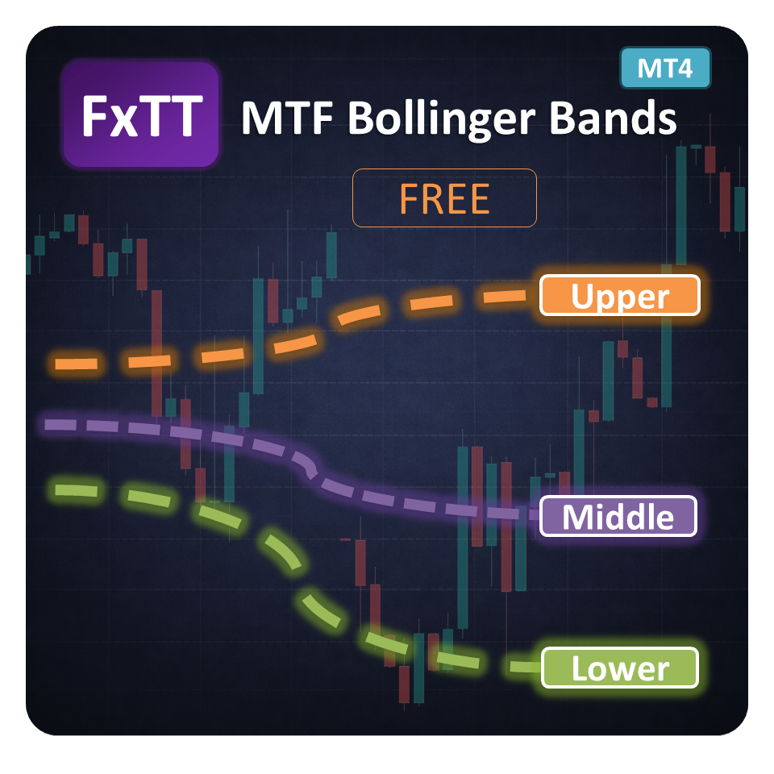

# MTF Bollinger Bands MT4 — Multi-Timeframe Bollinger Bands for MetaTrader 4

> **Free MT4 indicator.** Display Bollinger Bands from up to **9 timeframes** on one MetaTrader 4 chart, with a draggable panel for showing or hiding each timeframe.

---

---

## Overview

**MTF Bollinger Bands MT4** projects the upper, middle, and lower Bollinger Bands from nine standard timeframes onto the active MetaTrader 4 chart. Each timeframe keeps its own colour, while the middle band is solid and the outer bands are dashed. This makes higher-timeframe volatility and price location visible without changing chart windows.

A compact chart panel starts expanded, can be collapsed, and can be dragged to another position. Click a timeframe row to toggle its three bands. The panel position, expanded state, and timeframe visibility are saved per chart.

This repository contains the MT4 source implementation. It is not an Expert Advisor and does not place, manage, or modify trades.

**Canonical product page:** [forextradingtools.eu/en/marketplace/mtf-bollinger-bands](https://forextradingtools.eu/en/marketplace/mtf-bollinger-bands)

## Features

- Nine timeframes on one chart: MN1, W1, D1, H4, H1, M30, M15, M5, and M1.
- Three bands per timeframe: upper, middle, and lower.
- Standard MetaTrader Bollinger calculation using close prices.
- Configurable period, standard-deviation multiplier, and band shift.
- Colour-coded timeframe lines with dashed outer bands and a solid middle band.
- Draggable and collapsible on-chart control panel.
- One-click visibility toggles for each eligible timeframe.
- Right-side labels for visible upper, middle, and lower bands, with configurable bar offset and font size.
- Lower timeframes are automatically disabled when they are below the active chart timeframe.
- Chart-specific panel and visibility state persistence through terminal global variables.

## Supported timeframes

| Timeframe | Label | Colour |
|---|---|---|
| Monthly | MN1 | Magenta |
| Weekly | W1 | Dodger blue |
| Daily | D1 | Orange |
| 4-hour | H4 | Lime green |
| 1-hour | H1 | Gold |
| 30-minute | M30 | Tomato |
| 15-minute | M15 | Deep sky blue |
| 5-minute | M5 | Violet |
| 1-minute | M1 | Silver |

Timeframes lower than the active chart timeframe are disabled automatically. They become eligible again when the chart is changed to a lower timeframe.

## Installation

### Compile from source

1. Download or clone this repository.
2. Copy `src/FxTT_MTF_BollingerBands.mq4` to your terminal's `MQL4/Indicators` folder. Open it with **File → Open Data Folder** in MT4 to find the correct data folder.
3. Open the file in MetaEditor and press **Compile**. The resulting `FxTT_MTF_BollingerBands.ex4` is written beside the source file.
4. Return to MT4, open **Navigator** with **Ctrl+N**, right-click **Indicators**, and choose **Refresh**.
5. Drag **FxTT MTF Bollinger Bands** onto a chart and configure the inputs.

The `releases/` directory is reserved for packaged compiled releases. This source repository does not include a fabricated or precompiled binary.

### Updating

Detach the indicator, replace the source or compiled file, compile again if using the source, refresh the Navigator, and reattach the indicator. MT4 chart templates can preserve your configured inputs.

## Settings reference

### Bollinger Bands

| Input | Default | Description |
|---|---:|---|
| **Period** | `20` | Number of bars used for the moving average and standard deviation on each timeframe. Must be at least 1. |
| **Deviations** | `2.0` | Standard-deviation multiplier used for the upper and lower bands. Must be positive. |
| **Shift** | `0` | Horizontal Bollinger Bands shift in timeframe bars. |

The indicator uses `PRICE_CLOSE`, matching the standard MetaTrader Bollinger Bands calculation.

### Panel

| Input | Default | Description |
|---|---:|---|
| **Panel X** | `20` | Initial horizontal panel position in pixels from the upper-left chart corner. |
| **Panel Y** | `30` | Initial vertical panel position in pixels from the upper-left chart corner. |

Drag the `BB Panel` header to move the panel. Click the header to collapse or expand it.

### Band labels

| Input | Default | Description |
|---|---:|---|
| **Show right-side band labels** | `true` | Show or hide labels for visible band lines. |
| **Label shift to the right (bars)** | `1` | Number of active-chart bars to place labels to the right of the latest bar. Negative values are treated as zero. |
| **Label font size** | `8` | Font size for the labels. |

## Compatibility

| | |
|---|---|
| **Platform** | MetaTrader 4 only |
| **Timeframes** | M1 through MN1 |
| **Instruments** | Symbols supported by the connected MT4 broker, including forex, metals, indices, and crypto where offered |
| **Operating systems** | Windows MT4; Windows-compatible VPS |
| **Expert Advisors** | Visual indicator only; it does not place or manage trades |
| **MetaTrader 5** | Not compatible — use [MTF Bollinger Bands MT5](https://github.com/ForexTradingTools/fxtt-mt5-mtf-bollinger-bands) |

## Changelog

| Version | Date | Notes |
|---|---|---|
| **1.00** | September 2026 | Initial MT4 release with nine timeframe bands, draggable/collapsible panel, timeframe toggles, persistent panel state, configurable band labels, and configurable Bollinger inputs. |

## Source and release layout

- `src/` — compile-ready MQL4 source.
- `releases/` — location for packaged compiled MT4 releases when published.
- `screenshots/` — product screenshots used in this README and release materials.
- `LICENSE` — MIT license.

## Related ForexTradingTools repositories

### Bollinger Bands

- [MTF Bollinger Bands MT5](https://github.com/ForexTradingTools/fxtt-mt5-mtf-bollinger-bands)

### Moving averages and checklists

- [MTF Triple Moving Averages MT4](https://github.com/ForexTradingTools/fxtt-mt4-mtf-triple-moving-averages)
- [MTF Triple Moving Averages MT5](https://github.com/ForexTradingTools/fxtt-mt5-mtf-triple-moving-averages)
- [Strategy Checklist MT4](https://github.com/ForexTradingTools/fxtt-mt4-strategy-checklist)
- [Strategy Checklist MT5](https://github.com/ForexTradingTools/fxtt-mt5-strategy-checklist)

### Other free indicators

- [Forex Scanner MT4](https://github.com/ForexTradingTools/fxtt-mt4-forex-scanner)
- [Forex Scanner MT5](https://github.com/ForexTradingTools/fxtt-mt5-forex-scanner)
- [Pivot Points MT5](https://github.com/ForexTradingTools/fxtt-mt5-pivot-points)
- [Session High/Low MT5](https://github.com/ForexTradingTools/fxtt-mt5-session-high-low)
- [News Calendar MT5](https://github.com/ForexTradingTools/fxtt-mt5-news-calendar)
- [Zig Zag Zones MT5](https://github.com/ForexTradingTools/fxtt-mt5-zig-zag-zones)

More free indicators are available at [forextradingtools.eu](https://forextradingtools.eu).

## License

This project is released under the [MIT License](LICENSE).
